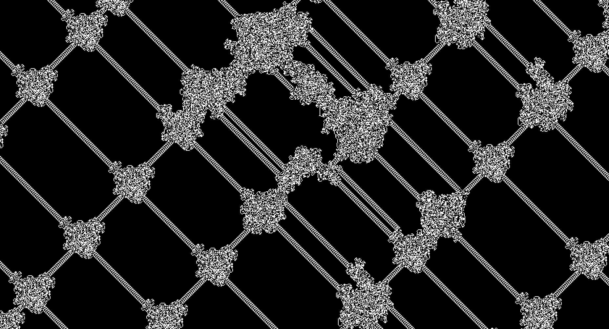
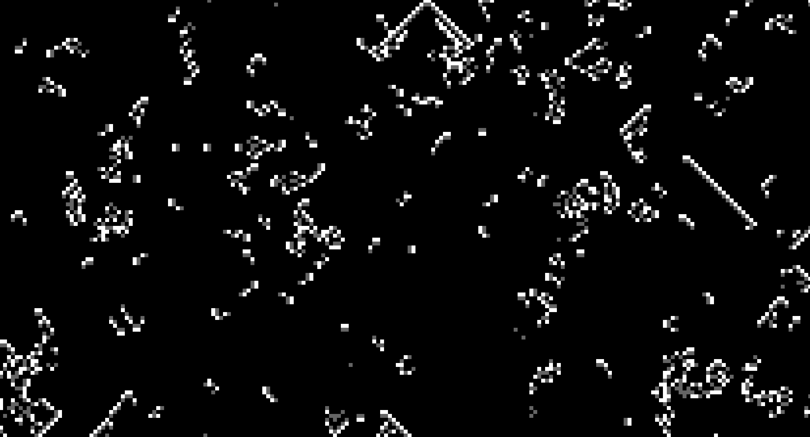
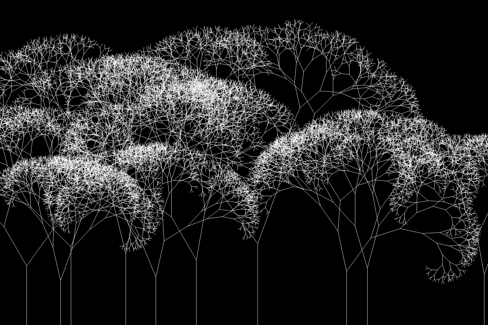
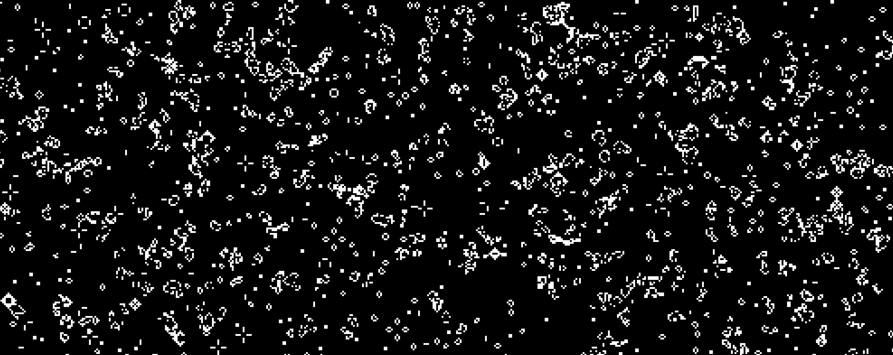
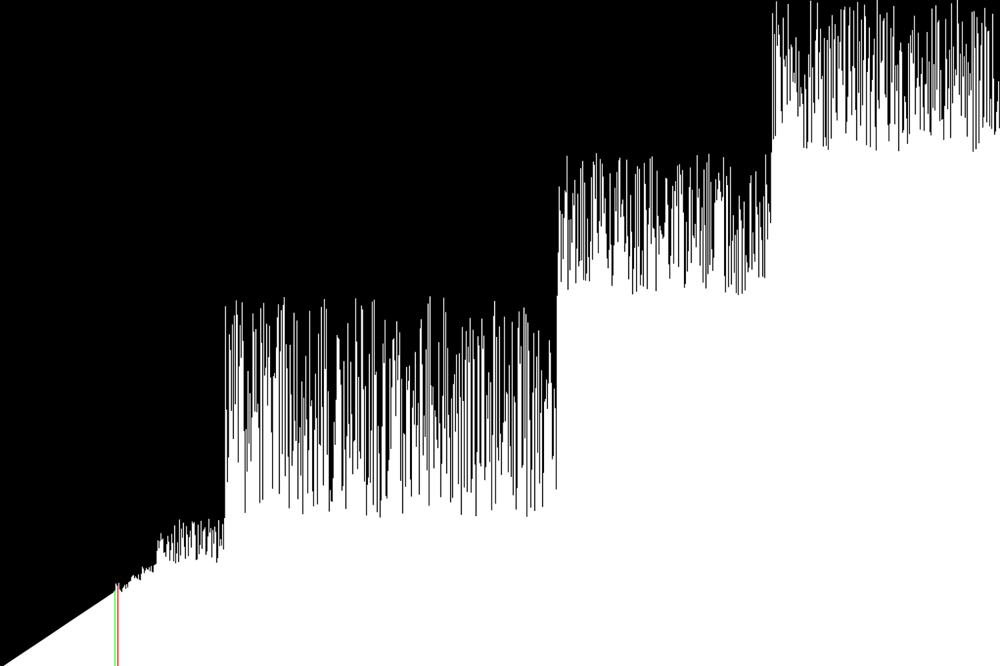
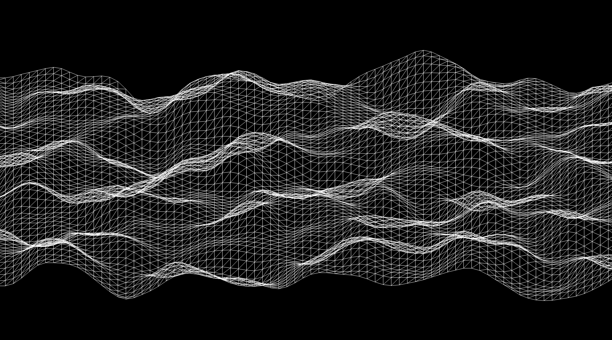

# Algorithms, Simulations and Generators Python Lab
A collection of algorithms, simulations, generators, utilities and mathematical scripts written in Python. Included are scripts ranging from N-body and flow field simulations to polynomial interpolation and Monte Carlo simulations.


## Installation and Usage
Setup your environment and install the required dependencies as follows:

1. **Clone the Repository:**
```bash
git clone https://github.com/fraserlove/algo-lab.git
cd algo-lab
```

2. **Create a Python Virtual Environment:**
```bash
python -m venv .venv
source .venv/bin/activate
```

3. **Install Dependencies via PIP:**

```bash
pip install -r requirements.txt
```
4. **Run Any Script:**
```bash
cd cellular-automata
python conways_game_of_life.py
```

## Included Scripts
  - Algorithmic Trading
    - Senate Long
  - Cellular Automata
    - Conway's Game of Life
    - Predator and Prey
    - Wire World
    - Langton's Ant
    - Brian's Brain
  - Computer Graphics
    - 3D Wireframe Engine 
    - FL3D - A 3D Rendering Engine
    - Snake
  - Encoding and Cryptography
    - Base64 Encoder and Decoder
    - Huffman Coding
    - MD5 Hashing
  - File Utilities
    - Image Resizer
    - Image Series to Video Convertor
    - PDF to Image Convertor
    - Python Import Wrapper
  - Graph Algorithms
    - DAG Topological Sorting (Lexicographical and Non-Lexicographical)
    - Eulerian Circuit and Hamiltionian Cycle Generators
    - Graham Scan
    - Greedy Colouring
    - Shortest Path
  - Mathematical Computing
    - Estimating PI
    - Fibonacci
    - Monte Carlo
    - Polynomial Constructor from Roots
    - Polynomial Interpolation
    - Random Deviates
  - Quantum Algorithms
    - Full Adder
    - Half Adder
  - Simulations and Generators
    - Perlin Noise Flow Field Generator
    - Fractal Tree Generator
    - 2D N-body Simulation
    - Solar System 2D Simulation
    - Perlin Noise Terrain Generator
  - Sorting Algorithms
    - Sorting Algorithm Runtime Plotting
    - Sorting Algorithm Visualiser
    - Sorting algorithms:
      - Selection
      - Bubble
      - Insertion
      - Shell
      - Radix
      - Cocktail
      - Merge
      - Bitonic
      - Quick
      - Heap
      - Bucket

## Screenshots








