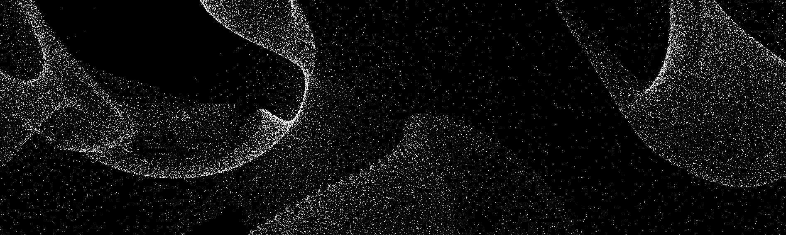

# PyLab
A collection of experiments written in Python.

## Installation and Usage
Setup your environment and install the required dependencies as follows:

1. **Clone the Repository:**
```sh
git clone https://github.com/fraserlove/pylab.git
cd pylab
```

2. **Create a Python Virtual Environment:**
```sh
python -m venv .venv
source .venv/bin/activate
```

3. **Install Dependencies via PIP:**

```sh
pip install -r requirements.txt
```
4. **Run Any Script:**
```sh
cd simulations/nbody
python nbody.py
```

## Screenshots
